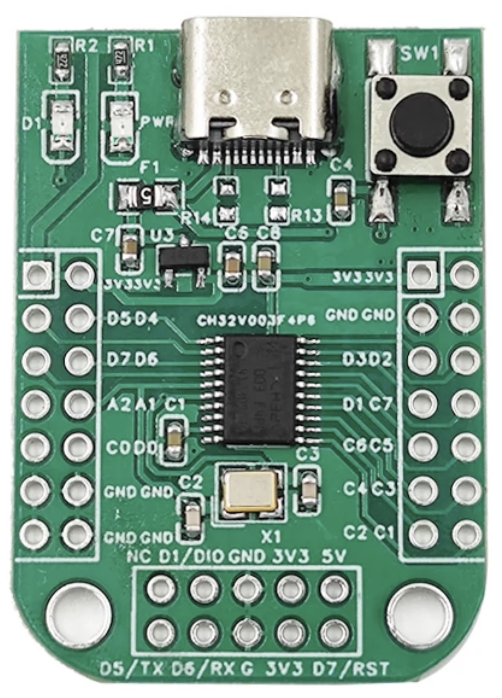

# CH32V003 Arduino on Windows Quick Start

The CH32V003 is a modern 32-bit RISCV-based MCU that is quickly gaining popularity due to its rich peripherals, generous resources, easy integration, and most importantly ultra-low-cost (<$0.20 in volume)

[WCH](https://www.wch-ic.com/), manufacturer of the CV32V line of MCUs, recommends [MounRiver Studio](http://www.mounriver.com/) as the preferred development environment for these MCUs. 

However many of us hobbyists and professionals prefer the familiar Arduino ecosystem, and thanks to the official [WCH CH32 Arduino core](https://github.com/openwch/arduino_core_ch32) we can now program several CH32V MCUs, including the CH32V003 right from within our familiar Arduino IDE. 

Note that this is a brand new Arduino core and under active development so expect some rough edges. 


## References
* [Product Page](https://www.wch-ic.com/products/CH32V003.html)
* [Datasheet](https://www.wch-ic.com/downloads/file/359.html)
* [CH32 Arduino Core](https://github.com/openwch/arduino_core_ch32)
* [Arduino IDE](https://www.arduino.cc/en/software)
* [WCH LinkUtility](https://www.wch.cn/downloads/WCH-LinkUtility_ZIP.html)

## Prerequisites
* Arduino IDE 2.x or newer
* WCH LinkUtility
  * [Direct Download](https://www.wch.cn/downloads/file/418.html)
  * [Download Page](https://www.wch.cn/downloads/WCH-LinkUtility_ZIP.html)
* CH32V003 Dev Board
  * [CH32V003 EVT](https://www.aliexpress.us/item/3256805083375266.html)
  * [Unofficial CH32V003 EVT Mini](https://www.aliexpress.us/item/3256805647735889.html)
* WCH LinkE Programmer
  * [WCH-LinkE](https://www.aliexpress.us/item/3256804994338353.html)
  * Note: It is very important to get the WCH-LinkE (note the `E` at the end) programmer, NOT the WCH-Link, WCH-DAPLink, or WCH-LinkW. If you are not certain you are buying the right one, consider buying a dev board and programmer bundle

## Install WCH LinkE Programmer Drivers

* Unplug WCH-LinkE Programmer from your computer
* Download and unzip `WCH-LinkUtility.ZIP`
  * [Direct Download](https://www.wch.cn/downloads/file/418.html)
  * [Download Page](https://www.wch.cn/downloads/WCH-LinkUtility_ZIP.html)
* Install drivers (accept User Access Control prompts or Run As Administrator)
  * `WCH-LinkUtility/CH372DRV_S.exe`
  * `WCH-LinkUtility/WCHLinkDrv_WHQL_S.exe`


## Install Official Arduino WCH Core

See instructions here: https://github.com/openwch/arduino_core_ch32

Relevant URL to add to `Additional Boards Managers URLs` is:
```
https://github.com/openwch/board_manager_files/raw/main/package_ch32v_index.json
```

Once board manager URL is updated, search for and install `CH32 MCU EVT Boards` in Boards Manager

*Note:* Version 1.0.4 has an issue which causes installation to fail on Windows running as a regular user. Consider using Version 1.0.3, trying one of the workarounds [discussed in this issue](https://github.com/openwch/arduino_core_ch32/issues/44), or waiting for this to be fixed in a newer release.


## Pin Map

Most CH32V003 dev boards label pins using their MCU names instead of Arduino names.

For example, `D4` label on a board usually means `MCU Port D, Pin 4` or `PD4` for short which is actually mapped to Arduino digital pin `D14`. 

Meanwhile, Arduino digital pin `D4` is mapped to `MCU Port C, Pin 2` or `PC2` for short and is often labeled on boards as `C2`.

Pin map for the `CH32V003F4 EVT` board variant is defined [here](https://github.com/openwch/arduino_core_ch32/blob/main/variants/CH32V00x/CH32V003F4/variant_CH32V003F4.cpp) and summarized below:

|MCU Pin Name|Arduino Pin Name|Special Function|
|---|---|---|
|PA1|D0, A1||
|PA2|D1, A0||
|PC0|D2||
|PC1|D3|SDA|
|PC2|D4|SCL|
|PC3|D5||
|PC4|D6, A2|SS|
|PC5|D7|SCK|
|PC6|D8|MOSI|
|PC7|D9|MISO|
|PD0|D10||
|PD1|D11|SWDIO|
|PD2|D12, A3||
|PD3|D13, A4||
|PD4|D14, A7||
|PD5|D15, A5|TX|
|PD6|D16, A6|RX|
|PD7|D17|NRST|


## Unofficial CH32V003 EVT Mini

This board is also frequently sold as `CH32V003 EVT` online, however it is NOT the same as the official CH32V003 EVT reference board design:



|Peripheral|Board Pin Label|MCU Pin Name|Arduino Pin Name|Notes|
|---|---|---|---|---|
|LED D1|D4|PD4|D14|LOW = on|
|Button SW1|D7/RST|PD7|D17|Reset on LOW|

|Programmer|Board Pin Label|MCU Pin Name|
|---|---|---|
|SWDIO|D1/DIO|PD1|
|3V3|3V3|VDD|
|GND|GND|VSS|

|Arduino Peripheral|Function|Board Pin Label|MCU Pin Name|
|---|---|---|---|
|Serial|RX|D6/RX|PD6|
|Serial|TX|D5/TX|PD5|
|Wire|SDA|C1|PC1|
|Wire|SCL|C2|PC2|
|SPI|COPI or MOSI|C6|PC6|
|SPI|CIPO or MISO|C7|PC7|
|SPI|SCK|C5|PC5|
|SPI|CS or SS|C4|PC4|


Additional Notes:
* Arduino Settings
  * Board -> CH32 MCU EVT Boards ->`CH32V00x`
  * Board Select -> `CH32V003F4 EVT`
* MCU Variant: CH32V003F4P6
* Board will NOT power on from a modern USB-C PD power supply connected using an USB-C-to-C cable. 
  * Connecting the board to a standard USB-A port or power supply using an USB-A-to-C cable will work just fine.
  * This is because R13 and R14 are left unpopulated - if they had a 5.1K resistor, then board would properly receive 5V from USB-C PD chargers.


